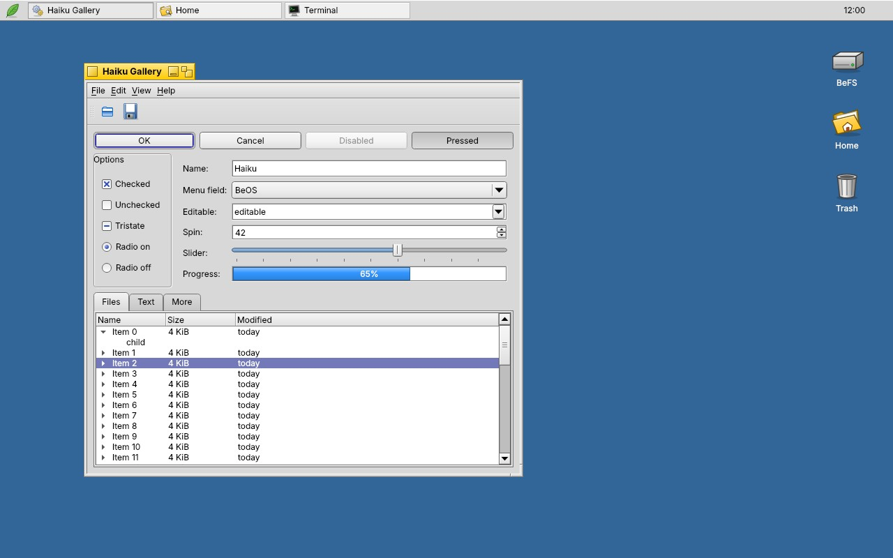

# Haiku / BeOS Theme für KDE Plasma 6

Globales Plasma-6-Theme im Stil der Haiku-R1-Oberfläche: gelbe Fenster-Reiter, graue Bevel-Widgets, blauer Desktop.



## Bestandteile

| Komponente | Ordner | Umsetzung |
|---|---|---|
| Globales Theme | `plasma/look-and-feel/org.haiku.desktop` | Defaults, Deskbar-Layout (Panel oben), Splash-Screen mit aufleuchtenden Icons |
| Farben | `colors/HaikuR1.colors` | KDE-Farbschema mit den Haiku-UI-Farben, inkl. `[WM]` (gelber Tab) |
| Anwendungs-Stil | `style/` | Natives Qt6-Style-Plugin (C++, `QProxyStyle` auf Fusion-Basis) |
| Fensterdekoration | `decoration/` | KDecoration3-Plugin (C++): Tab nur so breit wie der Titel, Schließen-Knopf links, Zoom rechts |
| Dekoration (Fallback) | `aurorae/themes/Haiku` | Aurorae-SVG-Theme ohne Kompilieren (Titelleiste über volle Breite) |
| Plasma-Stil | `plasma/desktoptheme/haiku` | Panel, Dialoge, Tooltips, Taskleiste, Buttons, Eingabefelder; Rest erbt von Breeze |
| Symbole | `icons/Haiku` | 48 eigene Icons (Ordner, Orte, Laufwerke, Dateitypen, Kern-Apps) + ~130 Aliasnamen, Rest erbt von Breeze |
| Mauszeiger | `cursors/Haiku-Cursors` | Xcursor-Theme, 21 Zeiger + Aliasnamen, 24/32/48/64 px, animierter Warte-Zeiger |

## Voraussetzungen

- Plasma **6.3 oder neuer** (die Dekoration nutzt die KDecoration3-API; geprüft gegen die Header von 6.3.0, 6.4.5 und dem aktuellen Entwicklungsstand)
- Zum Bauen (CachyOS/Arch): `sudo pacman -S --needed base-devel cmake qt6-base kdecoration kcoreaddons`
  – das Installationsskript prüft das selbst und fragt nach.

## Installation

```bash
cd ~/Claude/BeOS_Theme/haiku-theme
./install.sh            # baut beide Plugins (sudo für die Qt-Plugin-Ordner), installiert und aktiviert alles
./install.sh --layout   # wie oben, setzt zusätzlich Panel-Layout und blauen Desktop (ersetzt dein aktuelles Panel!)
./install.sh --no-build # nur Datenteile, Dekoration fällt dann auf Aurorae zurück
```

Danach einmal ab- und wieder anmelden, damit Cursor und Anwendungsstil in allen Programmen greifen.

Einzeln auswählbar sind die Teile auch über *Systemeinstellungen → Farben & Designs* (Globales Design „Haiku“, Anwendungsstil „Haiku“, Plasma-Stil „Haiku“, Fensterdekoration „Haiku“, Symbole „Haiku“, Zeiger „Haiku Cursors“).

Entfernen: `./uninstall.sh`

## Haiku-typisches Verhalten

- Knöpfe: Schließen links, Minimieren + Zoom rechts im Tab (`ButtonsOnLeft=X`, `ButtonsOnRight=IA`). Haiku selbst hat keinen Minimieren-Knopf; wer ihn nicht will, entfernt ihn unter *Fensterdekoration → Titelleisten-Knöpfe*.
- Doppelklick auf den Tab minimiert das Fenster (wie in Haiku).
- Fokus-Anzeige in Blau (B_NAVIGATION_BASE_COLOR), Häkchen als Kreuz, Scrollbalken mit Pfeilen an beiden Enden.

## Farben der Fensterdekoration

Die C++-Dekoration zeichnet den Tab immer in Haiku-Gelb, unabhängig vom Farbschema. Grund: KWin ignoriert den `[WM]`-Abschnitt eines Farbschemas, sobald es einen `[Colors:Header]`-Satz enthält, und liefert dann für Titelleiste *und* Rahmen das graue Header-Grau.
Anpassen lassen sich die Farben in `~/.config/haikudecorationrc`:

```ini
[Colors]
ActiveTab=255,203,0
InactiveTab=232,232,232
ActiveFrame=224,224,224
InactiveFrame=232,232,232
ActiveText=0,0,0
InactiveText=80,80,80
# true = Farben doch aus dem KWin-Farbschema übernehmen
UseColorScheme=false
```

Änderungen greifen nach `qdbus6 org.kde.KWin /KWin reconfigure` bzw. beim nächsten Fensteröffnen.

## Bereitstellung (AUR + store.kde.org)

- **AUR:** `haiku-plasma-theme-plugins` – Fensterdekoration und Anwendungsstil (C++), PKGBUILD in `aur/haiku-plasma-theme-plugins/`.
- **store.kde.org:** globales Design, Plasma-Stil, Farbschema, Icons, Zeiger und die Aurorae-Dekoration. `tools/build_store.sh` erzeugt in `dist/store/` je Store-Eintrag einen Ordner mit Datei, Screenshots und Beschreibungstext.
- Schritt-für-Schritt-Anleitung und Reihenfolge: `store/README.md`.
- `tools/set_github_user.sh <name>` ersetzt den Platzhalter `geraldgreiling` in PKGBUILD, Metadaten und Store-Texten.

Ohne Store installierbar sind alle Teile auch über „Aus Datei installieren“ in den Systemeinstellungen bzw. `kpackagetool6 -t Plasma/LookAndFeel -i Haiku-Global-Theme.tar.gz`.

## Bekannte Einschränkungen

- **Nicht in einer laufenden Plasma-Sitzung getestet.** Der Anwendungsstil wurde gebaut und mit einer Widget-Galerie gerendert, die Zeichenroutinen der Dekoration als Vorschau gerendert; das Dekorations-Plugin selbst wurde nur gegen die KDecoration3-/KCoreAddons-Header kompiliert, nicht in KWin geladen.
- Rechts neben dem Tab ist die Dekoration transparent, gehört für KWin aber zum oberen Rand: ein Klick dort startet eine Größenänderung nach oben statt durchzuklicken.
- Tabs lassen sich nicht wie in Haiku per Shift-Ziehen verschieben; kein Stapeln/Kacheln über Tabs.
- Die Haiku-Farbwerte stammen aus meinem Wissen über Haikus `InterfaceDefs.cpp`-Standardwerte (z. B. Tab 255/203/0, Panel 216/216/216, Desktop 51/102/152) und sind nicht gegen die aktuelle Quelle geprüft.
- Kein GTK-Theme: GTK-Programme bekommen nur die Farben über die Plasma-GTK-Integration.
- Icons decken nur den Kern ab; alles andere kommt von Breeze und wirkt daneben stilistisch anders.
- Eine vertikale Deskbar oben rechts (Haiku-Standard) ist mit Plasma-Bordmitteln unpraktisch, weil das Startmenü-Applet dann die volle Panelbreite einnimmt. Das Layout setzt deshalb eine horizontale Deskbar oben (in Haiku ebenfalls eine Option).

## Assets neu erzeugen

Icons, Cursor, Plasma-Stil und Aurorae-Fallback werden per Python erzeugt:

```bash
tools/build_assets.sh   # Cursor brauchen zusätzlich rsvg-convert (librsvg) und xcursorgen (xorg-xcursorgen)
```

Widget-Galerie zum Testen des Anwendungsstils:

```bash
cmake -S style -B build/gallery -DBUILD_GALLERY=ON && cmake --build build/gallery
build/gallery/haiku-gallery /tmp/gallery.png
```

## Lizenz und Hinweis

MIT. Alle Grafiken (Icons, Zeiger, SVGs) sind eigene Entwürfe im Stil von Haiku; es wurden keine Haiku- oder BeOS-Grafiken übernommen, auch keine Logos. Kein offizielles Projekt von Haiku, Inc.; „Haiku“ und „BeOS“ sind Marken ihrer jeweiligen Inhaber.
